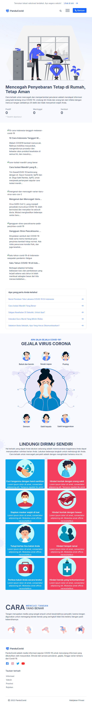

<div align="center">

  <h1>Panducovid</h1>  
  <p>
    Comprehensive COVID-19 awareness website
  </p>

<!-- Badges -->
<p>
  <a href="https://github.com/natainditama/panducovid/graphs/contributors">
    
  </a>
  <a href="https://github.com/natainditama/panducovid/issues/">
    
  </a>
  <a href="https://github.com/natainditama/panducovid/network/members">
    
  </a>
  <a href="https://github.com/natainditama/panducovid/graphs/commit-activity">
    
  </a>
  <a href="https://github.com/natainditama/panducovid/stargazers">
    
  </a>
  <a href="https://github.com/natainditama/panducovid/blob/master/LICENSE">
    
  </a>
  <a href="https://github.com/natainditama/panducovid">
    
  </a>
</p>
   
  <h4>
    <a href="https://github.com/natainditama/panducovid/">View Demo</a>
    <span> · </span>
    <a href="https://github.com/natainditama/panducovid">Documentation</a>
    <span> · </span>
    <a href="https://github.com/natainditama/panducovid/issues/">Report Bug</a>
    <span> · </span>
    <a href="https://github.com/natainditama/panducovid/issues/">Request Feature</a>
  </h4>
</div>

<br />

<div align="center"> 
  
</div>

<br />

<!-- About the Project -->
## 📝 About the Project

<!-- Features -->
### 🌟 Features

This project includes the following features:

- [Parcel](https://parceljs.org/) Bundler
- Responsive Design
- Modern HTML5 & CSS3
- [TailwindCSS](https://tailwindcss.com/) Styling
- SEO Optimization
- Cross-Browser Compatibility

<!-- Color Reference -->
### 🎨 Color Reference

| Color            | Hex                                                              |
| ---------------- | ---------------------------------------------------------------- |
| Primary Color    |  #1965ff |
| White Color  |  #ffffff |
| Text Color       |  #3d4b69 |
| Background Color |  #f7f9fe |

<!-- Getting Started -->
## 🚀 Getting Started

<!-- Prerequisites -->
### 🔧 Prerequisites

- [Node.js](http://nodejs.org/)
- [Yarn](https://yarnpkg.com/)

<!-- Run Locally -->
### 🏃 Run Locally

Clone the project

```bash
  git clone https://github.com/natainditama/panducovid.git
```

Go to the project directory

```bash
  cd panducovid
```

Install dependencies

```bash
  yarn
```

Start the server

```bash
  yarn start
```

<!-- Contributing -->
## 👋 Contributing

<a href="https://github.com/natainditama/panducovid/graphs/contributors">
  
</a><br/>

Contributions are always welcome!

See [contributing.md](https://github.com/natainditama/panducovid/blob/main/.github/CONTRIBUTING.md) for ways to get started.

<!-- License -->
## ⚠️ License

This project is licensed under the MIT License. See the [LICENSE](https://github.com/natainditama/panducovid/blob/main/LICENSE) file for details

<!-- Contact -->
## 🤝 Contact
Nata Inditama - [natainditama](https://linkedin.com/in/natainditama/) - natainditama.dev@gmail.com

Project Link: [https://github.com/natainditama/panducovid](https://github.com/natainditama/panducovid)

<!-- Resources -->
## 📚 Resources

- [Illustrations](https://scale.flexiple.com/illustrations/single/)
- [Illustrations](https://freeillustrations.xyz/)
- [Informations](https://covid19.go.id/)
